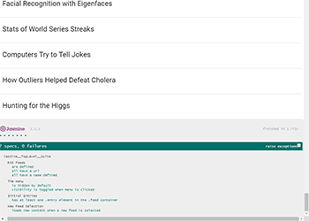

### Frontend Nanodegree Project
___

# Feed Reader Project

For this project we were provided with a web based application that reads **RSS** feeds. We then needed to implement testing of the app using the [Jasmine](http://jasmine.github.io/) testing framework. The original developer had set up their initial test suite and we needed to complete this task by completing the tests listed in **overview** below.

This is a project from Udacity's **Frontend Nanodegree** [program](https://www.udacity.com/course/front-end-web-developer-nanodegree--nd001).
___

___

## Overview

### The required tests:

- Write a test that loops through each feed in the **allFeeds** object and ensures it has a **URL** defined and that the **URL** is not empty.
- Write a test that loops through each feed in the **allFeeds** object and ensures it has a name defined and that the name is not empty.
- Write a new test suite named "The menu".
- Write a test that ensures the menu element is hidden by default.
- Write a test that ensures the menu changes visibility when the menu icon is clicked. This test should have two expectations: does the menu display when clicked and does it hide when clicked again.
- Write a test suite named "Initial Entries".
- Write a test that ensures when the loadFeed function is called and completes its work, there is at least a single **.entry** element within the **.feed** container.
- Write a test suite named "New Feed Selection".
- Write a test that ensures when a new feed is loaded by the **loadFeed** function that the content actually changes.

___

## Installation

To run the project please **fork** a copy to your **Git Hub** account and **clone** to your local machine with **Git**.

- Open **index.html** in the browser to view.
- The test suites and individual test results are listed at the bottom of page, or the failed tests are detailed.
- The actual tests are located in **jasmine/spec/feedreader.js**.